<div align="center">




[](https://linkedin.com/in/tolgatrkmn)
[](https://linkedin.com/in/tolgatrkmn)

</div>

## `> whoami`

```
Data Scientist & Machine Learning Engineer.
End-to-end ML lifecycle: data pipelines -> model architecture -> deployed inference.
Focus areas: Computer Vision, NLP, Generative AI / RAG, applied bioinformatics.
```

## `> tech_stack`

**Languages**

[](https://www.python.org/)
[](https://go.dev/)
[](https://www.typescriptlang.org/)
[](https://www.java.com/)

**ML & AI**

[](https://pytorch.org/)
[](https://www.tensorflow.org/)
[](https://keras.io/)
[](https://scikit-learn.org/)
[](https://opencv.org/)
[](https://jupyter.org/)

**Data & Analytics**

[](https://pandas.pydata.org/)
[](https://numpy.org/)
[](https://matplotlib.org/)
[](https://www.postgresql.org/)
[](https://www.microsoft.com/sql-server)
[](https://streamlit.io/)

**Backend & Web**

[](https://fastapi.tiangolo.com/)
[](https://nextjs.org/)
[](https://nodejs.org/)
[](https://react.dev/)

**Engineering & Cloud**

[](https://www.docker.com/)
[](https://aws.amazon.com/)
[](https://kafka.apache.org/)
[](https://spark.apache.org/)
[](https://git-scm.com/)
[](https://kernel.org/)

**Enterprise & SAP**

[](https://www.sap.com/products/technology-platform.html)
[](https://ui5.sap.com/)
[](https://experience.sap.com/fiori-design-web/)
[](https://cap.cloud.sap/docs/)
[](https://help.sap.com/docs/abap-cloud)
[](https://help.sap.com/docs/SAP_ERP/materials-management)

**Testing & CI/CD**

[](https://pytest.org/)
[](https://www.selenium.dev/)
[](https://cucumber.io/)
[](https://maven.apache.org/)
[](https://junit.org/junit5/)
[](https://github.com/features/actions)
[](https://www.postman.com/)

## `> featured_projects`

| Project | Domain | Stack | What it does |
|---|---|---|---|
| [**IntelliBrief**](https://github.com/tolgaturkmen01/intellibrief) | 🤖 Agentic AI | Python, Go, FastAPI, Kafka, Qdrant, Docker | Multi-agent research pipeline (Planner → Researcher → Critic → Writer); a dedicated critic agent verifies every claim against its source before the report is written. |
| [**Lung Cancer Risk Factor Analysis**](https://github.com/tolgaturkmen01/lungcanceranalysis) | 🏥 Clinical Statistics | Python, Statsmodels | Chi-square hypothesis testing on a 16-variable clinical dataset; identifies smoking and air-pollution exposure as significant risk factors (p < 0.001). |
| [**LumenRAG**](https://github.com/tolgaturkmen01/LumenRAG) | 🔎 Retrieval-Augmented Generation | TypeScript, Next.js, PostgreSQL (pgvector), MCP | Full-stack RAG platform with hybrid vector + keyword retrieval and document-type re-ranking; 5/5 hit@5 on a golden evaluation set. |
| [**Network Error-Correction Engine**](https://github.com/tolgaturkmen01/go-fec-engine) | 📡 Systems / Networking | Go | XOR-based Forward Error Correction engine with a concurrent, goroutine-driven simulation of a lossy network channel. |
| [**BioCGR**](https://github.com/tolgaturkmen01/biocgr) | 🧬 Bioinformatics | Python, Biopython | Alignment-free sequence-analysis framework converting nucleotide data into CGR-based features for large-scale genomic classification. |
| [**ML Job Market Analysis**](https://github.com/tolgaturkmen01/Machine-Learning-Job-Analysis-Project) | 💼 NLP / Market Analytics | Python, NLP, Streamlit | NLP pipeline predicting ML salaries from U.S. job postings, deployed as an interactive Streamlit app. |
| [**Sauce Demo Test Suite**](https://github.com/tolgaturkmen01/Sauce-Demo-Test) | 🧪 QA / Test Automation | Java, Maven, Cucumber, Selenium | BDD end-to-end test automation framework for the Sauce Demo e-commerce app — Gherkin scenarios, Selenium WebDriver, and native HTML/JSON reporting. |

## `> github_stats`

<div align="center">


</div>

## `> contribution_snake`

<!--START_SECTION:snake-->
<picture>
  <source media="(prefers-color-scheme: dark)" srcset="https://raw.githubusercontent.com/tolgaturkmen01/tolgaturkmen01/output/github-contribution-grid-snake-dark.svg" />
  <source media="(prefers-color-scheme: light)" srcset="https://raw.githubusercontent.com/tolgaturkmen01/tolgaturkmen01/output/github-contribution-grid-snake.svg" />
  
</picture>
<!--END_SECTION:snake-->
